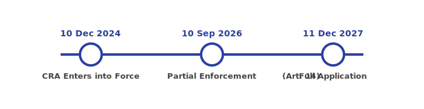

<!-- backgroundImage: "linear-gradient(135deg, #e0e7ff 0%, #b7caff 100%)" -->


# <span style="color:#2a3fa4;">European Union CRA Regulations</span>
## <span style="color:#3b4cca;">CRA, SBOM, CVE Scanning, and UI Development on Embedded Linux</span>

**Author:** Captain Charly Lima  
[https://github.com/charlylima](https://github.com/charlylima)

---

<!-- backgroundImage: "white" -->
<!-- paginate: true -->

# The CRA

The EU Cyber Resilience Act (CRA) introduces cybersecurity requirements for products with digital elements sold in the EU. 

---

# The CRA Timeline



- **January 2024:** CRA adopted by the European Parliament, published in the Official Journal of the EU, and enters into force.
- **October 2025:** Enforcement of certain CRA obligations begins (21 months after entry into force).
- **January 2027:** Full application and enforcement of all CRA requirements (3 years after entry into force).

---

# CRA Obligations After 21 Months

After 21 months (October 2025), manufacturers and suppliers must:

- Implement processes for receiving, handling, and disclosing vulnerabilities.
- Provide a contact point for vulnerability reporting.
- Address and communicate vulnerabilities in a timely manner.


---

# CRA Full Obligations in 2027

From January 2027, manufacturers and suppliers must ensure:

- Implementation of cybersecurity by design and by default.
- Provision of regular and timely security updates.
- Completion of conformity assessments to demonstrate compliance.
- Comprehensive transparency and documentation, including SBOM and clear user instructions.
- Ongoing monitoring and mitigation of vulnerabilities throughout the product lifecycle.

All CRA obligations are now fully enforced for products placed on the EU market.

--- 

# Most important requirements (1/2)

* Cybersecurity by Design: 
  Products must be designed with cybersecurity as a core principle, ensuring robust protection against cyber threats from the outset.

* Vulnerability Management: 
  Manufacturers are required to have processes for identifying, managing, and mitigating vulnerabilities throughout the product lifecycle.

* Security Updates: 
  Products must include mechanisms for providing regular and timely security updates to address vulnerabilities.

--- 

# Most important requirements (2/2)

* Conformity Assessment: 
  Products must undergo conformity assessments to ensure they meet the cybersecurity requirements set out in the CRA.

* Transparency and Documentation: 
  Manufacturers must provide documentation, including information on cybersecurity risks, vulnerabilities, and instructions for secure use.

* Vulnerability Reporting to Authorities: 
  Manufacturers are required to report actively exploited vulnerabilities and incidents to the relevant national authorities.

These measures aim to enhance the overall cybersecurity of digital products and protect users across the EU.

--- 

# Requirements on Security Updates

- **Duration:** Security updates must be provided for the expected lifetime of the product, or at least 5 years after it is placed on the EU market

- **Frequency:** Updates must be provided whenever a relevant vulnerability is identified.

- **Timeliness:** Security updates must be delivered without undue delay after a vulnerability is discovered, taking into account the severity and risk.

- **No Known Vulnerabilities:** If there are no known vulnerabilities, there is no obligation to provide an update. However, manufacturers must continue to monitor for vulnerabilities throughout the support period.

---

# What is a CVE?

A CVE (Common Vulnerabilities and Exposures) is a unique identifier for a publicly known cybersecurity vulnerability, to link it across various Databases world wide.

- non-profit MITRE Corporation assigns the ID
- Each CVE entry provides:
  * standardized ID
  * description
  * software version information
  * references and links

Example: `CVE-2024-12345` — A sample identifier for a specific vulnerability.

---

# Public CVE Databases

Several public databases provide information about CVEs:

- **NVD (National Vulnerability Database):**
  - Managed by NIST (U.S. government)
  - https://nvd.nist.gov

- **Google Open Source Vulnerability (OSV) Database:**
  - Focuses on open source ecosystems (npm, PyPI, Maven, Go, etc.)
  - https://osv.dev

- **GitHub Advisory Database:**
  - Community-driven, covers open source packages
  - https://github.com/advisories

---

# What is the difference to FOSS Scan?

- **FOSS Scan** 

  - Detecting open source software and licenses in your codebase
  - Identifying license compliance issues
  - Run once before release
  
- **Vulnerability Scan**
  - Up-to-date vulnerability monitoring and alerting in dependencies
  - Run periodically also on already release software, 
    as vulnerabilities become known

---

# How Can We Scan for Vulnerabilities?

- Generate and maintain a Software Bill of Materials (SBOM) to track all software components and their versions.
- Integrate tools like Dependency-Track to continuously monitor and analyze dependencies for vulnerabilities.
- Regularly update and review vulnerability databases (e.g., NVD, GitHub Advisory Database).
- Incorporate vulnerability scanning into the CI/CD pipeline for early detection and remediation.

--- 

# What is an SBOM?

A Software Bill of Materials (SBOM) is a detailed list of all software components, libraries, and dependencies included in a product.

- Identifies each component by name, version, and origin.
- in a technical data format that can be analyzed by tools
- human readable

---

# Example SBOM (in SPDX format)

```
SPDXVersion: SPDX-2.2
DataLicense: CC0-1.0
SPDXID: SPDXRef-DOCUMENT
DocumentName: ExampleProject

PackageName: Qt
PackageVersion: 5.15.2
PackageSupplier: The Qt Company
Relationship: Qt DEPENDS_ON OpenSSL

PackageName: OpenSSL
PackageVersion: 1.1.1k
PackageSupplier: OpenSSL Software Foundation
```

--- 

# SBOM Generation Tools

- **CMake Integration:** CMake projects can be configured to output dependency information, which can be used by SBOM tools.

- **FOSSology:** Open-source license compliance and SBOM generation tool for source code analysis.
  - Website: https://www.fossology.org/

- **Syft:** Open-source tool for generating SBOMs from container images and filesystems. Supports multiple output formats (SPDX, CycloneDX, etc.).
  - Website: https://github.com/anchore/syft

---

# SBOM Generation with Qt

- Qt 6.8 and newer provide built-in support for generating SBOMs.
- Enable SBOM generation by configuring your build with:
  ```
  cmake -DQT_GENERATE_SBOM=ON ...
  ```
- This will automatically create an SPDX SBOM file for your Qt-based project during the build process.
- For more details, see: https://wiki.qt.io/SBOM
- Qt has lots of 3rdParty dependencies: 
  https://doc.qt.io/qt-6/licenses-used-in-qt.html

---

# SBOM Generation with Yocto Linux

- Yocto Project (since version 4.2, "Mickledore") provides built-in support for SBOM generation.
- To enable SBOM generation, add to your `local.conf`:
  ```
  SBOM_GENERATE = "1"
  SBOM_FORMATS = "spdx cyclonedx"
  SBOM_OUTPUT_DIR = "${TMPDIR}/sbom"
  ```
- SBOMs are created automatically during the build and placed in the specified output directory.
- Yocto's SBOMs include all packages, dependencies, and license information.
- More info: https://docs.yoctoproject.org/dev-manual/common-tasks.html#generating-software-bill-of-materials-sbom

---

# What is Dependency Track?

Dependency-Track is an open-source, server-based platform for managing and monitoring software component dependencies and their associated vulnerabilities.

- Runs as a web application
- Continuously analyzes SBOMs to identify known vulnerabilities (CVEs) in third-party and open-source components.
- Integrates with vulnerability databases (e.g., NVD) for up-to-date risk information.
- Provides dashboards and reports for tracking risk and compliance.
- Supports integration into CI/CD pipelines
- Website: https://dependencytrack.org

---

# Working with Dependency Track (and similar alternatives)

- **Upload SBOMs:** 
Regularly generate SBOMs for your software (e.g., after each release or build) and upload them to Dependency-Track. This can be automated as part of your CI/CD pipeline.

- **Vulnerability Notifications:** 
Configure Dependency-Track to send notifications (e.g., email, webhook, or integrations with ticketing systems)

- **Monitor Dashboards:** 
Use the web dashboard to monitor the status of your projects.

---

# How to react on vulnerabilities

- Assess the risk and impact of reported vulnerabilities 
  (vulnerability might be irrelevant for your software)
- Prioritize and plan Update if necessary
- Document actions taken and update the SBOM

---

# Requirements on Reaction Time to Vulnerabilities

- Vulnerabilities must be addressed and remediated without undue delay, considering their severity and risk.
- Actively exploited vulnerabilities or incidents must be reported to the relevant national authorities within 24 hours of awareness.
- Users must be informed about available mitigations or updates in a timely manner.

---

# What does CRA mean for my Smartphone?

- Under the CRA, manufacturers must provide security updates for the expected lifetime of the device, or **at least 5 years** after it is placed on the EU market.
- Does not mean you would get major operating system updates or new features

---

# Questions: Do we need SBOM for non-connected devices?

-> Purely analog devices or those with absolutely no data connection capability are not covered.
see [EU Regulation 2024/2847, Article 2 "Scope"](https://eur-lex.europa.eu/legal-content/EN/TXT/HTML/?uri=OJ:L_202402847#art_2)

---

# The End
